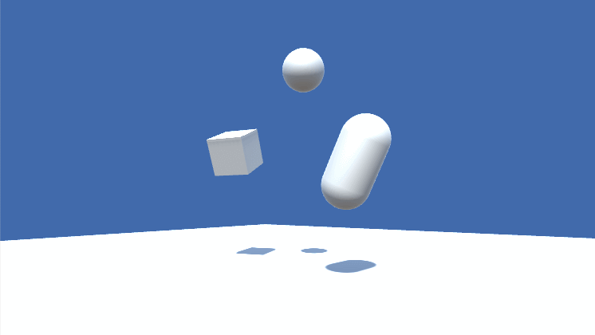
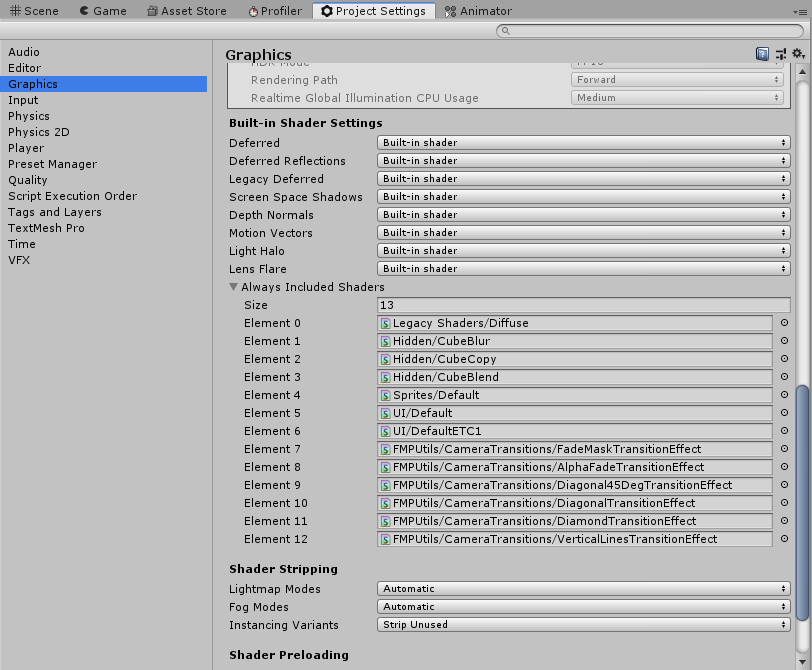
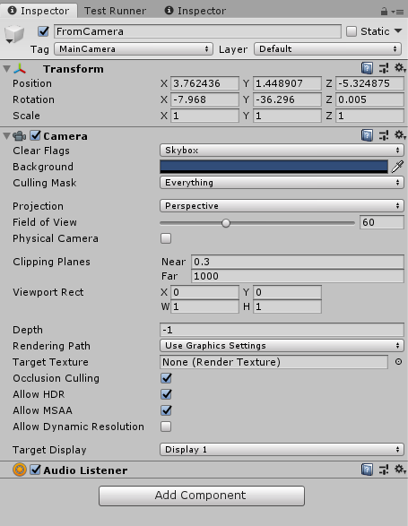
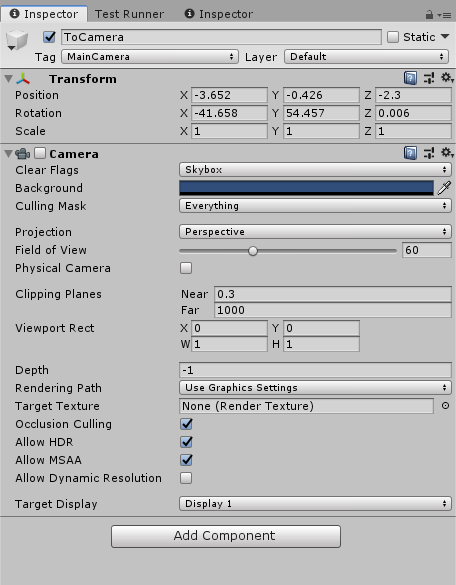

# Camera Transitions for the Built-In Render Pipeline

This project shows an easy way of transitioning between 2 ingame cameras with minimal setup overhead. 



## General Usage

### Running a Transition
The transition logic is handled by the CameraTransitionEffectController class and its instance is a singleton. There can only be one transition active at the same time. Starting a new transition while another transition is already active will cancel the active transition. The 
There are 3 ways to perform a transition. The effect test script shows all of them (`Assets/FMPUtils/Utilities/Visuals/CameraTransition/Example/TransitionEffectTester.cs`)

**1. Built-in Transition Effects** 

```cs
CameraTransitionEffectController.Instance.ActivateTransition<T>(Camera fromCamera, Camera toCamera, float transitionDuration, bool reassignAudioListener = false) where T : CameraTransitionEffectBase, ITransitionCameraEffect, new()
```
This approach doesn't require any material setups and takes a generic type argument where the type has to be an implementation of `CameraTransitionEffectBase`. The transition is then played using the shader that matches the chosen effect, using its default properties. 

**2. Passing a Mask Texture**
```cs
CameraTransitionEffectController.Instance.ActivateTransition(Camera fromCamera, Camera toCamera, Texture transitionFadeMaskTexture, float transitionDuration, bool reassignAudioListener = false)
```
A greyscale texture can be used to control when the camera visibiliy for each pixel should switch. When the transition progress (between 0 and 1) exceeds the mask color value for a certain pixel, the pixel of the ToCamera (transition target camera) is displayed, otherwise the FromCamera pixel is displayed. To immediately show the ToCamera pixel at the start of a transition, use a black color (value 0), for showing the ToCamera at the very end of the transition, use a white color (value 1). 

**3. Passing a Custom Material Used for the Transition Image Effect** 
```cs
CameraTransitionEffectController.Instance.ActivateTransition(Camera fromCamera, Camera toCamera, Material imageEffectMaterial, bool createNewMaterialInstance, float transitionDuration, bool reassignAudioListener = false)
```
A custom ImageEffect material can be passed for the transition. To have the transition use a copy of the passed material instead of the original, set `createNewMaterialInstance` to true. This is useful to prevent the transition from changing the properties of the passed material. 

The shader used by the material needs to have a `_OriginCamTex` 2D texture property to store the texture that the fromCamera renders into and needs to have a `_TransitionProgress` Float property to control the progress of the transition. 

**Common Parameters**
- `fromCamera`: Initially active camera that should be transitioned from. Disabled at the end the the transition
- `toCamera`: Target camera to transition towards
- `transitionDuration`: Time to complete the transition. Zero or negative values result in an almost immediate transition. 
- `reassignAudioListener`: If true, will do the following at the start of the transition: Remove the AudioListener component from the fromCamera if present and add an AudioListener component to the toCamera if not present. For more details refer to the [ToCamera setup details](#tocamera-transition-target-camera-configuration)

### Ending an Ongoing Transition 
```cs
CameraTransitionEffectController.Instance.EndActiveTransition();
```

### Always Included Shaders

The shaders that are only used programmatically and not references by a material or asset included in the game should be added to the "Always Included Shaders" (Project Settings / Graphics / Always Included Shaders). This is necessary because Unity will not include shaders in the build that are not references by an included asset. If you're unsure which shaders are referenced in your used materials, a safe approach is to include all shaders from the folder "Assets/FMPUtils/Utilities/Visuals/CameraTransition/Shaders". 


## Component Setup

### FromCamera (transition origin camera) configuration


The camera that should be the main/active one before the transition starts. At the start of the transition, the camera will have a RenderTexture assigned and starts to render to it instead of the screen. At the end of the transition, the FromCamera is disabled. 

### ToCamera (transition target camera) configuration


In this example, the camera component is disabled and there is no AudioListener on the GameObject. At the start of the transition, the camera will be enabled and its GameObject activated. During the transition, an ImageEffect script is added to the camera which handles the transition effect and will be removed when the transition has finished. The transition logic will not edit the depth of the cameras as of now, so to make sure that a setup works indepentendly from the depth values of the participating cameras, which determine the rendering order of individual cameras. The ToCamera (or transition target camera) can simply be disabled before the transition, or its GameObject deactivated to avoid having the ToCamera render over the FromCamera before the transition. Unity will complain when there is more than 1 AudioListener in the scene, and only one can be active at the same time. The AudioListener is instead attached to the FromCamera and the transition logic allows to remove the AudioListener from the FromCamera and attach an AudioListener to the ToCamera at the start of the transition. This can be set with the `reassignAudioListener` parameter. 

## Transition Effect Examples

### Diagonal


### Diagonal with 45 Degree Consistency


### Vertical Lines


### Diamond


### Alpha Fade


### Fade Mask Texture
